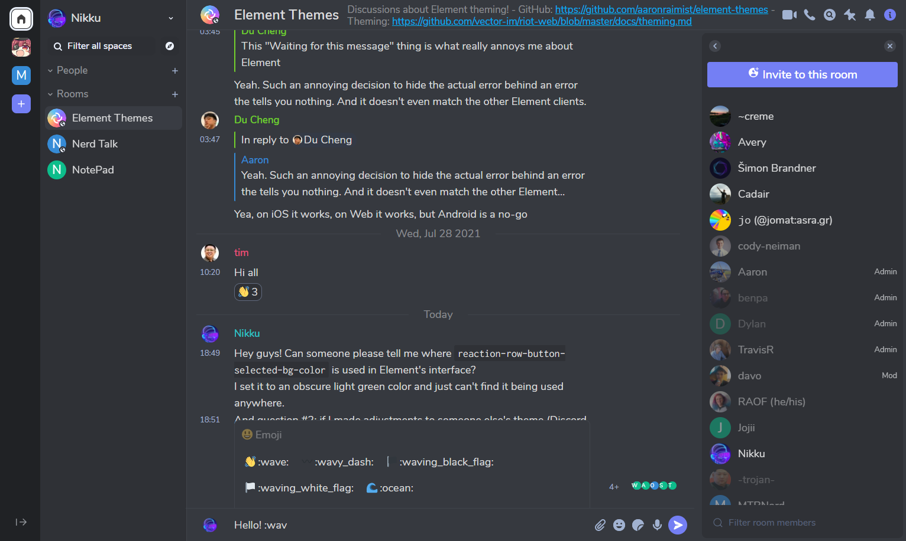
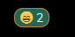
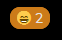

# Element Web Themes
A place to share themes for [Element Web](https://github.com/vector-im/element-web). Element's [theming documentation](https://github.com/vector-im/element-web/blob/master/docs/theming.md) has more information on how these work.

These themes are using the relatively basic Element theming system which can only change a limited number of colors. For more advanced themes where you want to customize all the colors or things like fonts and button shapes you'll need to use custom CSS files. See https://github.com/dannycolin/riot-compact for an example of a more advanced theme.

#### Discussions
Join us in [#element-themes:raim.ist](https://matrix.to/#/!pjCLhvJxLkGjNQFqcB:m.dhdf.dev?via=raim.ist&via=matrix.org&via=dhdf.dev)

### Table of Contents
- [How to use themes](#how-to-use-themes)
  * [If you self host Element or use Element Desktop](#if-you-self-host-element-or-use-element-desktop)
  * [If you use the matrix-docker-ansible-deploy project](#if-you-use-the-matrix-docker-ansible-deploy-project)
  * [If you are a Firefox user](#if-you-are-a-firefox-user)
  * [Or use my instance of Element Web](#use-my-element-web-instance)
- [Themes](#themes)
  * [Discord Dark Theme](#discord-dark-theme)
  * [Geeko Dark Theme](#geeko-dark-theme)
  * [Luxury Dark Theme](#luxury-dark-theme)
  * [Nord Dark Theme](#nord-dark-theme)
  * [Nord Light Theme](#nord-light-theme)
  * [Selenized Black Theme](#selenized-black-theme)
  * [Selenized Dark Theme](#selenized-dark-theme)
  * [Selenized Light Theme](#selenized-light-theme)
  * [ThomCat Black](#thomcat-black)
  * [Dracula Dark Theme](#dracula-dark-theme)
  * [Dracula Flat Dark Theme](#dracula-flat-dark-theme)
- [Advanced](#advanced)
  * [Workarounds](#workarounds)
  * [build.py](#build.py)


### How to use themes

There are several different ways to install these. For most users it will be easiest to enable the `feature_custom_themes` labs flag. This will allow you to install themes by pasting in the URL to the raw JSON of the theme. Hopefully in the future this interface will be polished up and enabled by default for all users.

Some other options for installing themes:

#### If you self host Element or use Element Desktop:
You can use these themes by editing your `config.json` file to include the theme inside of the `settingDefaults` section like this:

```json
{
    "settingDefaults": {
        "custom_themes": [
            {
                "name": "Example theme",
                "colors": {
                    "primary-color": "#9F8652"
                }
            },
            {
                "name": "Another theme",
                "colors": {
                    "primary-color": "#526A9E"
                }
            }
        ]
    }
}
```

To setup a `config.json` file with Element Desktop, see https://github.com/vector-im/element-desktop#user-specified-configjson

#### If you use the matrix-docker-ansible-deploy project
You can enable all of these themes just by setting `matrix_client_element_themes_enabled: true` in your `vars.yml` file. See https://github.com/spantaleev/matrix-docker-ansible-deploy/blob/master/docs/configuring-playbook-client-element.md#themes for more details.

#### If you are a Firefox user
You can install Radical which is Element bundled as a Firefox add-on. You can edit the `config.json` file right in the add-on preferences. It works really well, you should check it out. https://addons.mozilla.org/en-US/firefox/addon/radical-web/

#### Use my Element Web instance
Alternatively you can use [my Element Web instance](https://riot.raim.ist) which has all of these themes preinstalled so there is no configuration required.


# Themes

## [ThomCat Black](https://raw.githubusercontent.com/aaronraimist/element-themes/master/ThomCat/ThomCat-Black.json)

Made by `@me:thomcat.rocks`


## [Discord Dark Theme](https://raw.githubusercontent.com/aaronraimist/element-themes/master/Discord/Discord-Dark/Discord-Dark-Theme.json)

Made by [`@dylhack:dhdf.dev`](https://github.com/dylhack)




## [Luxury Dark Theme](https://raw.githubusercontent.com/aaronraimist/element-themes/master/Luxury/Luxury%20Dark/Luxury%20Dark.json)

Made by [`@dylhack:dhdf.dev`](https://github.com/dylhack)


## [Nord Dark Theme](https://raw.githubusercontent.com/aaronraimist/element-themes/master/Nord/Nord%20Dark/Nord%20Dark.json)

Made by [`@dylhack:dhdf.dev`](https://github.com/dylhack)


## [Nord Light Theme](https://raw.githubusercontent.com/aaronraimist/element-themes/master/Nord/Nord%20Light/Nord%20Light.json)

Made by [`@dylhack:dhdf.dev`](https://github.com/dylhack)


## [Selenized Light Theme](https://raw.githubusercontent.com/aaronraimist/element-themes/master/Selenized/Selenized%20Light/Selenized%20Light.json)

Made by [`@dylhack:dhdf.dev`](https://github.com/dylhack)


## [Selenized Dark Theme](https://raw.githubusercontent.com/aaronraimist/element-themes/master/Selenized/Selenized%20Dark/Selenized%20Dark.json)

Made by [`@dylhack:dhdf.dev`](https://github.com/dylhack)


## [Selenized Black Theme](https://raw.githubusercontent.com/aaronraimist/element-themes/master/Selenized/Selenized%20Black/Selenized%20Black.json)

Made by [`@dylhack:dhdf.dev`](https://github.com/dylhack) and `@david:vovo.id.au`


## [Geeko Dark Theme](https://raw.githubusercontent.com/aaronraimist/element-themes/master/Geeko%20Dark/Geeko%20Dark.json)

Made by `@swedneck:feneas.org`


## [Dracula Dark Theme](https://raw.githubusercontent.com/aaronraimist/element-themes/master/Dracula/Non-flat/Dracula.json)

Made by `@jakobr_107:utwente.io`


## [Dracula Flat Dark Theme](https://raw.githubusercontent.com/aaronraimist/element-themes/master/Dracula/Flat/DraculaFlat.json)

Made by `@jo:catgirl.party`


# Advanced

## Workarounds

Element's theme implementation is fairly limited so custom themes might introduce some odd elements. For example, when using ThomCat Black, the selected reaction 'pill' is outlined in green since Element doesn't give us a variable to control the color that is used there.



To fix this, we have to edit the custom theme CSS file directly, in this case `theme-dark-custom.css`.  `cssbeautify-cli` is not necessary if your `sed`-fu is better than the author's is.

```
cssbeautify-cli -f theme-dark-custom.css > /tmp/theme-dark-custom-sed.css
sed '/.mx_ReactionsRowButton.mx_ReactionsRowButton_selected/!b;n;c\ \ \ \ background-color:var(--accent-color);' /tmp/theme-dark-custom-sed.css > /tmp/theme-dark-custom.css
sudo -u <nginx/apache_user> cp /tmp/theme-dark-custom.css /<element_directory>/bundles/<bundle_version>/
```
The results:



## build.py
There is a [build.py](./build.py) python file which takes all the themes and 
outputs it to a file as an array of JSON. Simply execute it in this directory.
