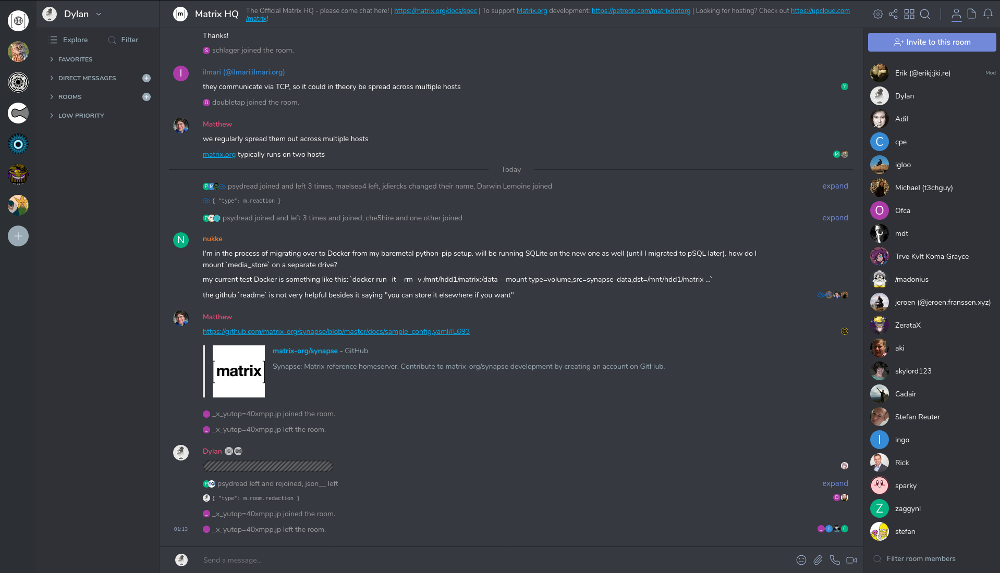

# riot-web-themes
A place to share themes for [Riot Web](https://github.com/vector-im/riot-web). See the [theming documentation](https://github.com/vector-im/riot-web/blob/master/docs/theming.md) for more information on how these work.

There are several different ways to use these. Unfortunately [Riot doesn't yet provide an easy one click way to install themes](https://github.com/vector-im/riot-web/issues/12517). Some options for installing themes include:

#### If you self host Riot or use Riot Desktop:
You can use these themes by editing your `config.json` file to include the theme inside of the `settingDefaults` section like this:

```json
"settingDefaults": {
    "custom_themes": [
        {
            "name": "Example theme",
            "colors": {
                "primary-color": "#9F8652"
            }
        },
        {
            "name": "Another theme",
            "colors": {
                "primary-color": "#526A9E"
            }
        }
    ]
}
```

To setup a `config.json` file with Riot Desktop, see https://github.com/vector-im/riot-web/blob/master/docs/config.md#desktop-app-configuration


#### If you are a Firefox user
You can install Radical which is Riot web bundled as a Firefox add-on. You can edit the `config.json` file right in the add-on preferences. It works really well, you should check it out. https://addons.mozilla.org/en-US/firefox/addon/radical-web/

#### Use my Riot Web instance
Alternatively you can use [my Riot Web instance](https://riot.raim.ist) which has all of these themes preinstalled so there is no configuration required.

#### Discussions
Join us in [#riot-web-themes:m.dhdf.dev](https://matrix.to/#/!pjCLhvJxLkGjNQFqcB:m.dhdf.dev?via=m.dhdf.dev&via=raim.ist&via=t2bot.io)


# Themes

## [ThomCat Black](ThomCat-Black/ThomCat-Black.json)

Made by `@me:thomcat.rocks`


## [Discord Dark Theme](Discord-Dark-Theme/Discord-Dark-Theme.json)

Made by `@dhmf:dhdf.dev`




## [Nord Theme](Nord/Nord.json)

Made by `@dhmf:dhdf.dev`

